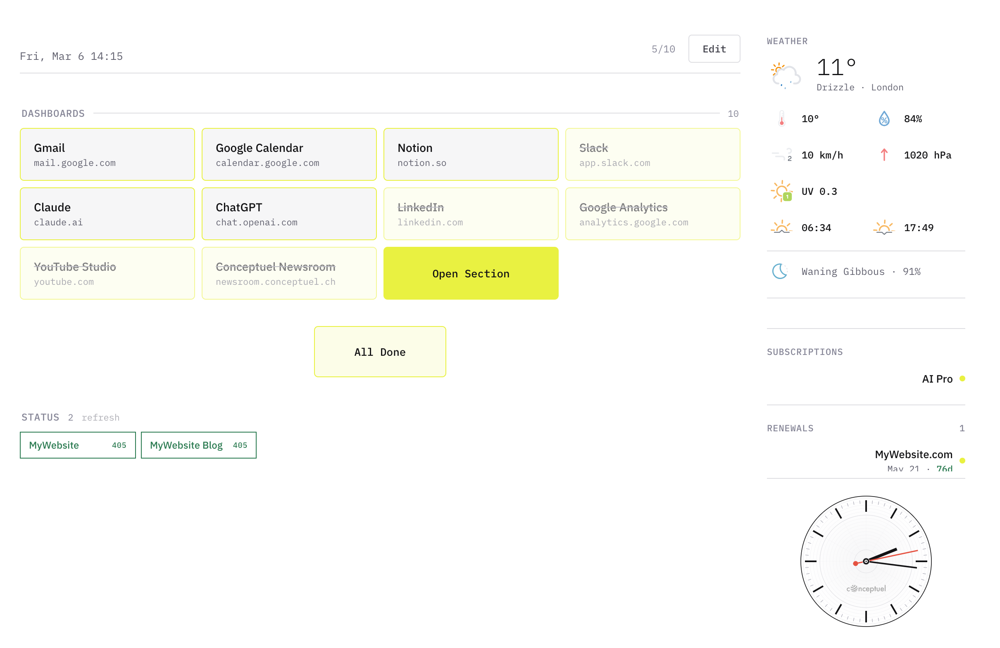

<p align="center">
  
</p>

<p align="center">
  <em>Your entire morning in one tab. Open it. Check everything. Close it. Go.</em>
</p>

<p align="center">
  
  
  
  
</p>

<p align="center">
  <a href="https://conceptuel.ch/morgen" target="_blank">Website</a> · <a href="https://conceptuel.ch/morgen" target="_blank">Download</a> · <a href="#getting-started">Quick Start</a>
</p>

---

Every morning you open 12 tabs, check the weather on your phone, wonder what time it is in Tokyo, forget which subscription renews today, and lose 50 minutes before your day even starts.

Morgen replaces all of that with a single page.

It's a local-first morning dashboard: weather, links, world clocks, site monitors, subscriptions, moon phase. It runs entirely on your machine. No account. No cloud. No tracking. You open it, you do your morning check-in, you close it.

Built with Go and plain JavaScript. No frameworks, no build step, no nonsense.

Designed and built by <a href="https://conceptuel.ch" target="_blank">Robbie Conceptuel</a>

## Preview

<p align="center">
  
</p>

## Why this exists

I wanted a single page I could open every morning that told me everything I needed to know. Without logging into anything, without notifications, without an algorithm deciding what's important. So I built it.

## Features

Morning links · Weather forecast · Moon phase · Site monitor · World clocks · Subscription tracker · Analog clock · Color themes · Custom cities · Daily reset at midnight

## Getting started

### Download

Grab the latest release for your platform at <a href="https://conceptuel.ch/morgen" target="_blank">conceptuel.ch/morgen</a>.

### Run from source

Requires <a href="https://go.dev/dl/" target="_blank">Go</a> 1.21+.

Don't have Go installed? Here's the quickest way:

```bash
# macOS (Homebrew)
brew install go

# Linux
sudo apt install golang   # Debian/Ubuntu
sudo dnf install golang   # Fedora

# Or download directly from https://go.dev/dl/
```

Then clone and run:

```bash
git clone https://github.com/RobbieConceptuel/morgen.git
cd morgen
go build -o morgen && ./morgen
```

Opens at `localhost:9210`. A setup screen walks you through city, accent color, timezones, links, monitors, and subscriptions.

### macOS

```bash
cp -r Morgen.app /Applications/
```

On macOS Sequoia+, unsigned apps get blocked. Run this once:

```bash
xattr -cr /Applications/Morgen.app
```

Then open Morgen from Applications.

### Linux

```bash
tar xzf morgen-linux-amd64.tar.gz
./morgen-linux-amd64
```

Browser opens automatically.

## Build for all platforms

```bash
chmod +x build.sh && ./build.sh
```

Creates ready-to-ship packages in `dist/`:

| File | Platform |
|------|----------|
| `Morgen.app` | macOS (Universal, Intel + Apple Silicon) |
| `morgen-linux-amd64.tar.gz` | Linux x86_64 |
| `morgen-linux-arm64.tar.gz` | Linux ARM64 (Raspberry Pi, etc.) |
| `morgen-windows-amd64.exe` | Windows |

## License

MIT. Check the [LICENSE](LICENSE)

<p align="center">
  <a href="https://conceptuel.ch" target="_blank">
    
  </a>
</p>
